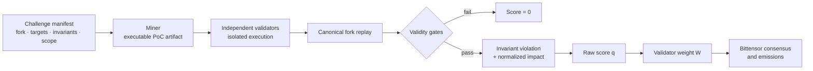

# InvVer

[한국어](./README.ko.md)

> **Break the invariant. Verify the exploit.**

**InvVer** is a Bittensor subnet protocol for discovering unknown vulnerabilities in EVM smart contracts through **executable, invariant-breaking proofs of concept** and **deterministic fork replay**.

The name combines **Invariant** and **Verification**. InvVer replaces vulnerability-label matching with a stricter test:

```text
Did the submitted transaction sequence violate a declared invariant
under the canonical challenge environment?
```

The vulnerability does not need to appear in a pre-existing answer set. The proof must execute, reproduce, and break a condition that the protocol declares inviolable.

This repository defines the InvVer benchmark, miner artifact, validator execution flow, scoring rules, and disclosure boundary.

---

## Why InvVer

Most smart-contract audit benchmarks require a ground-truth finding list before evaluation begins. A contract is paired with previously confirmed vulnerabilities, and submissions are rewarded for matching that list.

That structure creates three failures:

1. **Finite or public answers are cheaper to memorize than to discover.**
2. **A real new vulnerability can be rejected because it is absent from the answer set.**
3. **A vulnerability report does not prove that the issue is exploitable.**

InvVer removes the exhaustive vulnerability list from the scoring path.

```text
“Did the miner name a known vulnerability?”
                    ↓
“Did the miner produce a valid execution that broke the invariant?”
```

An invariant is a condition that must remain true for a protocol to be considered safe. Examples include:

- protocol assets remain greater than or equal to liabilities;
- total supply never increases without an authorized cause;
- an unprivileged account cannot transfer another user's assets;
- a withdrawal cannot make the protocol insolvent;
- governance state cannot change without the required authorization and delay.

The challenge fixes the invariant before miners compete. Miners discover the execution that breaks it.

---

## Incentive Thesis

A subnet does not reward its mission statement. It rewards its benchmark.

Miners are economically driven to find the cheapest path to a high score. InvVer therefore makes the desired security artifact the shortest valid path to reward:

> **A miner earns a positive score only by submitting a reproducible execution that violates a declared invariant.**

Finding an exploit is creative, expensive, and difficult. Replaying a submitted exploit against a fixed fork is deterministic and comparatively cheap.

```text
Expensive search by miners
        >
Cheap verification by validators
```

This search–verification asymmetry is the foundation of the market.

---

## Protocol Overview



1. A challenge publishes a canonical manifest.
2. Miners search for an attack and submit an executable PoC artifact.
3. Validators execute the artifact independently in isolated environments.
4. Invalid, non-deterministic, privileged, or out-of-scope submissions receive a score of zero.
5. Valid submissions are ranked by the impact measured by the challenge's executable monitors.
6. Validators convert raw scores into Bittensor weights.
7. Subtensor aggregates validator weights and settles emissions.

Subtensor does not execute the exploit or define the invariant. InvVer performs challenge construction, execution, verification, and raw scoring off-chain.

---

## Roles

### Challenge Authors

Challenge authors publish the environment that makes every verdict interpretable:

- chain ID and fork block;
- target contracts and allowed dependencies;
- executable invariant monitors;
- attacker permissions and initial resources;
- prohibited cheatcodes and state manipulation;
- time, gas, capital, and execution limits;
- impact-accounting rules.

A natural-language invariant is documentation. The executable monitor is the scoring oracle.

### Miners

Miners search for executions that violate one or more declared invariants.

A miner artifact contains:

- a deterministic transaction sequence;
- calldata and attacker accounts;
- helper contracts required by the attack;
- only the assumptions allowed by the challenge manifest;
- a Foundry-compatible test or an equivalent executable package;
- structured metadata describing the claimed impact.

The metadata is a claim. The replayed state transition is the evidence.

### Validators

Validators independently:

1. load the canonical challenge manifest;
2. initialize the specified fork;
3. run the miner artifact in an isolated sandbox;
4. reject forbidden state mutation and out-of-scope privilege use;
5. execute the invariant and impact monitors;
6. produce a deterministic verdict and raw score;
7. convert raw scores into Bittensor weights.

Validators do not score how persuasive a natural-language report sounds. They execute fixed artifacts against fixed monitors.

---

## Challenge Manifest

Every challenge freezes its evaluation assumptions before miners compete.

```yaml
version: "1"
challenge_id: example-001
chain_id: 1
fork_block: 00000000

targets:
  - "0x..."

invariants:
  - id: solvency
    description: "Assets must remain greater than or equal to liabilities"
    monitor: "SolvencyInvariant"

impact:
  monitor: "NetProtocolLoss"
  normalization_cap: "..."

attacker:
  permissions: unprivileged
  initial_capital_limit: "..."

forbidden_operations:
  - direct_storage_write
  - arbitrary_balance_injection
  - impersonation_outside_manifest

execution:
  timeout_seconds: 300
  deterministic_seed: "..."
```

The manifest is part of the oracle. A successful replay proves a violation **under the assumptions fixed by that manifest**.

---

## Validation and Scoring

### Mandatory Validity Gates

A submission receives no positive score unless every mandatory condition passes.

```text
Valid =
    executable
    AND deterministic_replay
    AND invariant_violation
    AND scope_compliance
    AND permitted_attacker
    AND no_forbidden_state_cheat
```

### Score

InvVer separates validity from ranking.

```text
Score = Valid × NormalizedImpact
```

- `Valid = 0` produces a final score of `0`.
- `NormalizedImpact` is calculated by the impact monitor fixed in the challenge manifest.
- Every validator executes the same monitor against the same post-state.

Impact monitors cover protocol-specific consequences such as:

- net asset loss;
- unauthorized minting;
- insolvency;
- permanent fund lock;
- unauthorized governance control;
- violation of access-control guarantees.

---

## Benchmark Integrity

The benchmark is the market. If miners can obtain reward without producing real security value, the subnet rewards benchmark exploitation instead of vulnerability discovery.

InvVer enforces the following benchmark properties.

### 1. Independent Reproducibility

The same manifest and artifact produce the same verdict across independent validators.

### 2. Capability Dependence

The score depends on the claimed vulnerability mechanism.

```text
vulnerable contract + PoC       → succeeds
root-cause patch + same PoC     → fails
clean twin + same PoC           → fails
```

### 3. Trivial-Baseline Resistance

The reward threshold remains above the scores achieved by:

- empty artifacts;
- random transaction sequences;
- public exploit templates;
- unmodified static analyzers;
- standard fuzzers;
- generator-aware rule sets.

### 4. Hidden-Distribution Generalization

Evaluation includes unseen contracts, states, transaction sequences, and challenge families. Historical incidents serve calibration and regression; they do not define the complete market.

### 5. Rank Separation

The score difference between top submissions exceeds evaluation noise. A saturated benchmark does not allocate emissions reliably.

### 6. Generator Independence

The challenge generator creates situations. It does not reveal the answer. Miners must still construct an execution that passes every validity gate.

---

## What Execution Proves

A successful InvVer replay proves that:

- the artifact executes in the declared environment;
- the transaction sequence is reproducible;
- the declared invariant is violated under the manifest assumptions;
- the resulting state transition and measured impact are independently observable;
- the result does not rely on prohibited state manipulation enforced by the sandbox.

Execution does not prove that:

- the invariant perfectly represents every aspect of the protocol team's intent;
- the attacker model represents every real market condition;
- token loss alone captures the full severity of every failure;
- two different traces necessarily represent different root causes.

InvVer eliminates non-reproducible vulnerability claims from the scoring path. It keeps semantic assumptions explicit in the manifest.

---

## Design Lineage

The table compares the protocol patterns that motivated InvVer. Historical names refer to the studied protocol versions, not the current state of any netuid.

| Approach                                     | Miner output         | Evaluation oracle                                          | Structural limitation                                                                                          |
| -------------------------------------------- | -------------------- | ---------------------------------------------------------- | -------------------------------------------------------------------------------------------------------------- |
| BitAudit-style fixed-label auditing          | Vulnerability report | Public dataset labels                                      | Memorization and benchmark contamination                                                                       |
| ReinforcedAI-style injected-label auditing   | Vulnerability report | Generator's planted label                                  | The generator becomes the answer key and limits the bug vocabulary                                             |
| Bitsec-style human-ground-truth benchmarking | Reusable audit agent | Previously confirmed findings                              | Ground truth remains expensive, novel findings are difficult to credit, and the exploit itself is not replayed |
| **InvVer**                                   | **Executable PoC**   | **Fork replay + executable invariant and impact monitors** | **Invariant quality and challenge realism are explicit protocol responsibilities**                             |

InvVer does not eliminate the benchmark. It makes the benchmark require the artifact that the market exists to produce.

---

## Why Bittensor

InvVer uses Bittensor for the layer that benefits from open competition:

- permissionless participation by independent security researchers and agents;
- continuous economic pressure to discover stronger attacks;
- multiple validators independently replaying the same artifact;
- consensus and emission settlement from validator weights;
- rewards for validated discoveries without an exhaustive vulnerability list.

The responsibility boundary is explicit:

```text
InvVer
→ challenge generation, artifact rules, sandbox execution,
  invariants, impact accounting, anti-cheat checks,
  raw scores, validator weights

Subtensor
→ UID and stake records, weight recording,
  consensus, incentives, and settlement
```

Bittensor is not the exploit oracle. InvVer supplies the auditable and reproducible oracle.

---

## Security and Responsible Disclosure

InvVer evaluates authorized targets in forked environments. Attacking live contracts without explicit authorization is outside the protocol.

Sensitive findings follow a controlled disclosure flow:

1. the artifact remains encrypted or access-controlled during evaluation;
2. duplicate findings are resolved before payout attribution;
3. the affected project receives the reproducible PoC and patch guidance;
4. validators confirm the patched contract rejects the original PoC;
5. public disclosure occurs only after the embargo and remediation window;
6. active challenges can be suspended when disclosure creates live-system risk.

No live-system exploitation is required to earn reward.

---

## Core Principles

1. **No exhaustive vulnerability answer list.**
2. **No positive score without executable proof.**
3. **The same artifact produces the same verdict across validators.**
4. **Invariant and impact assumptions are fixed before competition.**
5. **Forbidden state manipulation produces a zero score.**
6. **Historical exploits are regression tests, not the final benchmark.**
7. **Sensitive findings follow responsible disclosure.**

---

## Project

InvVer is developed by **Anam145**.
